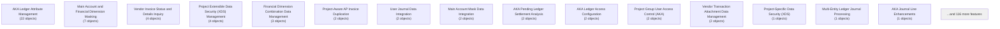

# Feature Overview Diagram

This diagram shows the features in the project and their sizes.

```mermaid
graph TD
    N_AKA_Ledger_Attribute_Management["AKA Ledger Attribute Management<br/>(22 objects)"]
    N_Main_Account_and_Financial_Dimension_Masking["Main Account and Financial Dimension Masking<br/>(7 objects)"]
    N_Vendor_Invoice_Status_and_Details_Inquiry["Vendor Invoice Status and Details Inquiry<br/>(4 objects)"]
    N_Project_Extensible_Data_Security__XDS__Management["Project Extensible Data Security (XDS) Management<br/>(4 objects)"]
    N_Financial_Dimension_Combination_Data_Management["Financial Dimension Combination Data Management<br/>(3 objects)"]
    N_Project_Aware_AP_Invoice_Duplication["Project-Aware AP Invoice Duplication<br/>(2 objects)"]
    N_User_Journal_Data_Integration["User Journal Data Integration<br/>(2 objects)"]
    N_Main_Account_Mask_Data_Integration["Main Account Mask Data Integration<br/>(2 objects)"]
    N_AKA_Pending_Ledger_Settlement_Analysis["AKA Pending Ledger Settlement Analysis<br/>(2 objects)"]
    N_AKA_Ledger_Access_Configuration["AKA Ledger Access Configuration<br/>(2 objects)"]
    N_Project_Group_User_Access_Control__AKA_["Project Group User Access Control (AKA)<br/>(2 objects)"]
    N_Vendor_Transaction_Attachment_Data_Management["Vendor Transaction Attachment Data Management<br/>(2 objects)"]
    N_Project_Specific_Data_Security__XDS_["Project-Specific Data Security (XDS)<br/>(1 objects)"]
    N_Multi_Entity_Ledger_Journal_Processing["Multi-Entity Ledger Journal Processing<br/>(1 objects)"]
    N_AKA_Journal_Line_Enhancements["AKA Journal Line Enhancements<br/>(1 objects)"]
    More["...and 116 more features"]:::note
    classDef note fill:#F0F0F0
```

---

*[← Back to Index](../index.md)*
